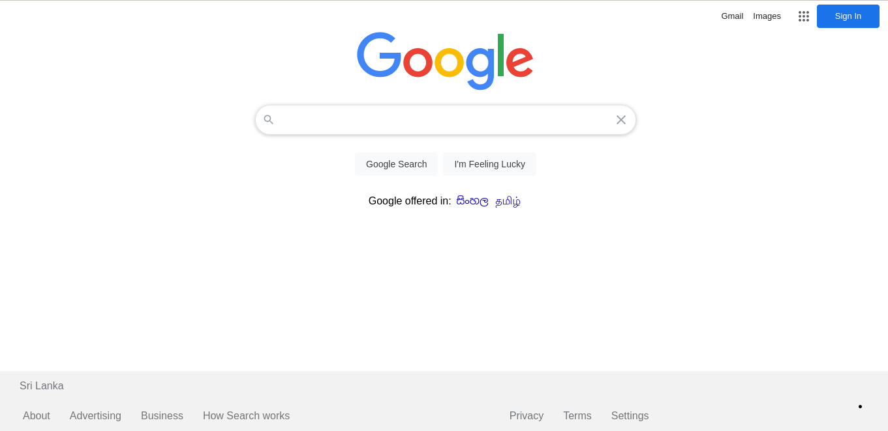

# Google Search Clone

Google Clone done by me with HTML5 and CSS3. **Media Queries** had used in this project to make website responsive. **Grid Layout** had used in Google app sub menu. By consuming google search web service, search results are displayed.

## Technologies Used

- HTML 5 
- CSS 3 

## How to use this repository

- Open terminal in desired location
- Clone Repository Using

`git clone https://github.com/sandarubc/google-clone.git`

## Contatct

Linkedin @ [Sandaru Akalanka](https://www.linkedin.com/in/sandaru-akalanka-464776188/)

Project Link